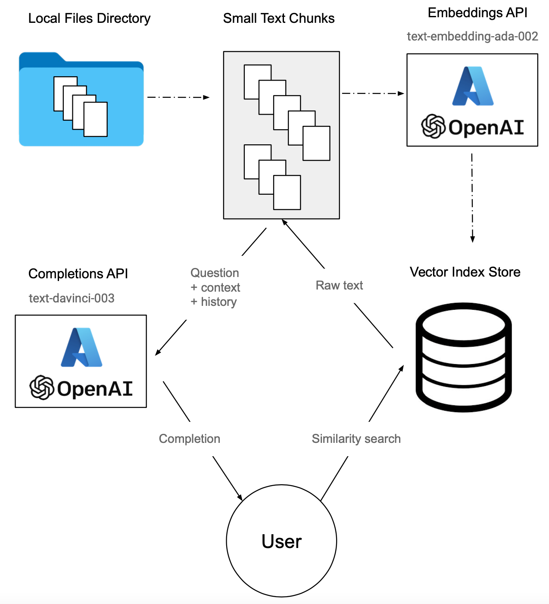

# Azure OpenAI
An intelligent, conversational, context-aware chatbot that can be utilized to answer questions about your own documented data.

This repository utilizes Meta's in-memory vector index [Faiss](https://ai.meta.com/tools/faiss/), as well as [LangChain](https://github.com/hwchase17/langchain) Python library, and Azure OpenAI's [Embedding](https://learn.microsoft.com/en-us/azure/cognitive-services/openai/reference#embeddings) and [Completion](https://learn.microsoft.com/en-us/azure/cognitive-services/openai/reference#completions) services.

## Prerequisites
You should have an Azure account with a running instance of OpenAI.

## Workflow



Creating a Vector Index (dashed arrows flow)
1. Load the data with a document loader.
2. Parse and split the data into smaller text chunks with a text splitter.
3. Send the documents to embedding model to generate the embedding vectors.
4. Store the embeddings in a vector database, which allows for efficient organization and access to vector data.

Generating a Completion (solid arrows flow)
1. Use LLM to rephrase the question and add some context from the conversation.
2. After you have full, standalone question, perform semantic similarity search in the vector database.
3. Get the raw text that matches the resulting vectors (supported by the vector databases).
4. Pass the context information, along with the user's question, to the LLM to generate final answer.

## Environment

1. Clone the repository:

   ```
   git clone https://github.com/hanit-com/azure-openai-conversational-chatbot.git
   ```

2. Create a Python environment:

   ```
   python -m venv .venv
   ```

3. Activate the environment:

   ```
   source .venv/bin/activate
   ```

4. Install the dependencies:

   ```
   pip install -r requirements.txt
   ```

## Configuration

1. Create a file named '.env' with the following variables.
Complete the API key and the Azure resource endpoint base from your azure account.
Select an instance on the [Cognitive Services Hub](https://portal.azure.com/#view/Microsoft_Azure_ProjectOxford/CognitiveServicesHub/~/OpenAI) and go to "Keys and Endpoints".  
Use either "KEY 1" or "KEY 2" and the "Endpoint" field.

   ```
   OPENAI_API_KEY=
   OPENAI_API_BASE=
   OPENAI_API_VERSION=2023-05-15
   ```
2. Add your data files to the 'context_data/data' directory.

3. Uncomment `insert_data_to_store()` in order to create a vector index at the first run.
After running the program once, re-comment the function.


## Usage

Run:

```
python azure_openai.py
```

In order to terminate the program, type `exit` in the prompt.

### Prompt Example
(Using data from the Wikipedia page [Coronation of Charles III and Camilla](https://en.wikipedia.org/wiki/Coronation_of_Charles_III_and_Camilla)).

Notice that the questions do not have to be full, the chain will rephrase each question to provide it some context from the conversation.
```
Prompt: When the coronation took place?
The coronation took place on May 6, 2023.
Prompt: Where?
The coronation took place at Westminster Abbey.
Prompt: Why there?
The coronation took place at Westminster Abbey because it is a traditional location for British coronations, with the last 40 monarchs being crowned there since William the Conqueror in 1066.
```

